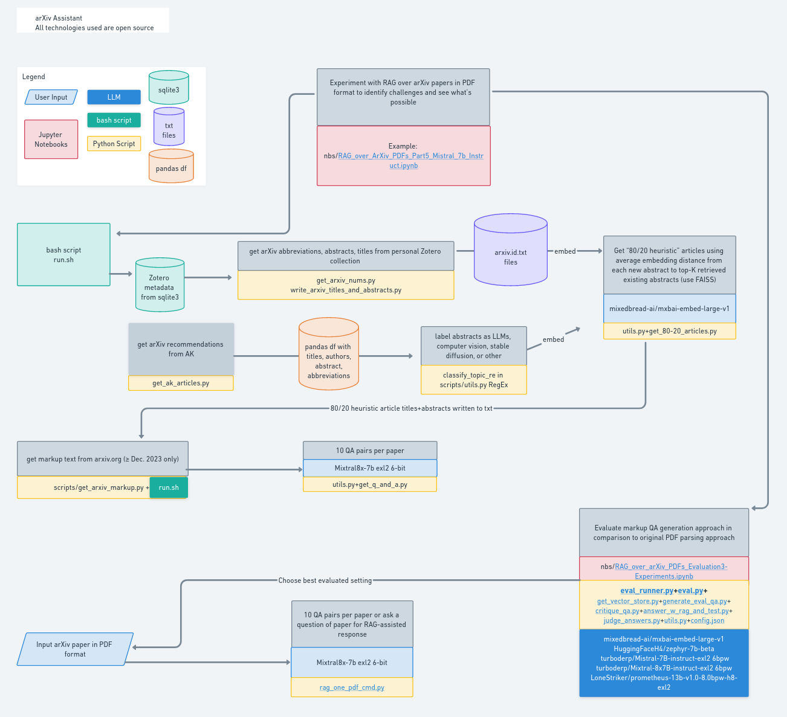

# arXiv LLMs Assistant

Image by author, made with [whimsical](https://whimsical.com)
## In Progress

- The goal is to fill in knowledge gaps in NLP (later other domains, perhaps) by comparing out-of-repository papers with papers in a personal repo.  Currently testing with RAG over some ArXiv papers in PDF format, retrieving from a couple dozen ArXiv LLM papers. Plan to connect to additional recommendations from AK's daily papers.  May write scripts to grab new Zotero papers and add embeddings made from them to vector store, then make scripts for Zotero <-> AK's papers to happen dynamically.

DONE:

    - Set up the initial pipeline with RecursiveCharacterTextSplitter (1000 chunks with 30 overlap), FAISS, and Llama2-13b.
    - Preprocess the data by only loading the articles up to the References section as References were first to be retrieved otherwise, which is not useful
    - Tried HuggingFaceH4/zephyr-7b-beta. Much less memory (7-8GB) used and faster generation. Can be bit fragile to promping (know issue with current Zephyr models) but works well with TextLoader. 
    - Mistral-7b-Instruct performs well: blazing fast compared to the original Llama2-13b and subjectively better answer quality. Experimenting with fine tuning it on ArXiv ML abstracts and titles to further adapt it to the domain (more for practice with instruction tuning).
    - Extract additional articles (for now tested with a single article and ArXiv API) and use abstract summaries to learn about articles similar/different from the ones in the vector store.  The idea is to fill in knowledge gaps in the field. Done via scraping AK's titles and abstracts (wrote script to do this weekly).
    - Add metadata with article title for easier verification of sources.
    - Get Mixtral-8x-7b to work with RAG. Answer quality does not go down if Mixtral has 'seen' the paper and Mixtral is able to answer the question due to additional context from RAG if it has.  The response is returned in real time with exl2-quantized 6bit version.
  
TODOS:

    - Test fine tuned version (checkpoint-64)
    - Evaluate individual pieces of the RAG pipeline
    - See if can categorize the paper into NLP, CV, or stable diffusion, then can aim to fill in knowledge gaps in that domain using current ArXiv papers. The model may do this out of the box with zero shot learning (likely) or could fine tune.
    - Perhaps use llamaindex Knowledge Agents? 
    - Next, see if Pinecone/Elasticsearch gives more flexibility over the use of metadata for retrieval
   
