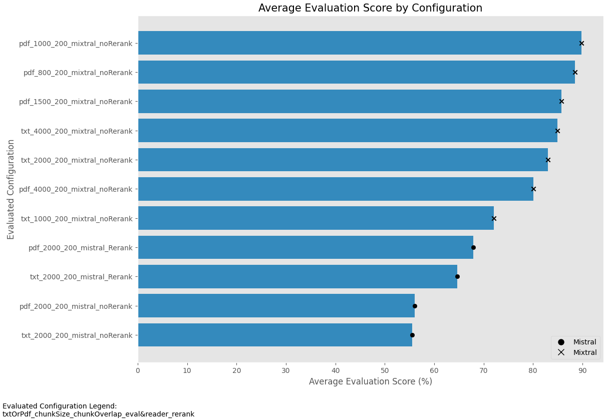
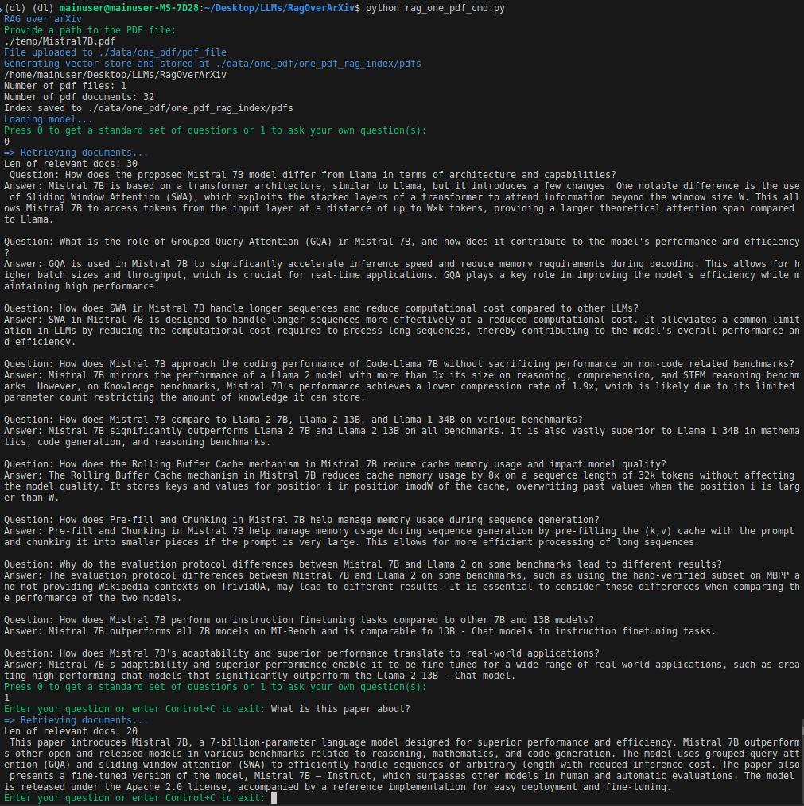

# arXiv LLMs Assistant

Image by author, made with [whimsical](https://whimsical.com)

### There are two goals for this project
- Goal 1: Assist in studying the LLM domain by comparing out-of-repository papers with papers in a personal repo (in Zotero), then recommending new papers to read along with providing a list of question/answer pairs for each recommended paper
- Goal 2: Run RAG over new papers, helping with generating questions to gain a deep understanding, for example.  For this purpose, RAG is evaluated with different configurations and the best evaluated configuration is selected.

### Installation and requirements
Using this project requires installing exllamav2, then cloning the desired quantization of the model.  For this project, 6.0bpw was chosen since it fits on two 3090s and has very [minimal quality loss compare to full model](https://huggingface.co/turboderp/Mixtral-8x7B-instruct-exl2).  The most amount of memory used in the project was about 44 GB, but to fit on a single 24GB GPU, 3-4bpw model could probably be chosen at a small quality tradeoff.  Mixtral quantized with exl2 can be installed as follows:

- `pip install huggingface-hub[cli] exllamav2`
- `huggingface-cli download turboderp/Mixtral-8x7B-instruct-exl2 --revision 6.0bpw --local-dir-use-symlinks False --local-dir MiStralInference/`
In addition, parts of the project require Firefox and Selenium web driver.  See installation instruction [here](https://dev.to/eugenedorfling/installing-the-firefox-web-driver-on-linux-for-selenium-d45)
- Package requirements used for this project are listed in requirements.txt, but not all of them may be necessary depending on use case

### Evaluation
- The original starting point was a notebook on [RAG Evaluation](https://huggingface.co/learn/cookbook/en/rag_evaluation#evaluating-rag-performance) by HuggingFace
- There are LLM multiple models involved in evaluation pipeline, and to fit it all on two 3090 GPUs, the code was refactored into scripts (so that each subprocess would release the GPU memory once done)
- In addition, to conserve memory and increase speed, 6bpw exl2 quantizations were used for Mistral and Mixtral due to their excellent [perplexity scores](https://huggingface.co/turboderp/Mixtral-8x7B-instruct-exl2)
- Prompts were further tweaked to improve performance and regular expressions modified to better extract necessary information from model outputs
- Finally, in the spirit of keeping all parts of the projects open source, Prometheus Eval was used (8bpw exl2) as an alternative to GPT-4 evaluation
- From the evaluation results below, adding reranking to Mistral has shown to be effective (about 10% improvement for Mistral)
- Upgrading the model from Mistral to Mixtral yielded the most improvement (about 20%), followed by chunk size and choice of retrieving from HTML->txt or PDF version of the paper (another 10%).  Notably, optimal chunk size is also highly dependent on whether retrieval is from HTML->txt or PDF.  A graph showing a subset of evaluation results is below:
 

### Other findings and potential future directions
- It's best to preprocess the data by only loading the articles up to the References section as References were first to be retrieved otherwise, which is not useful
- Currently, papers are selected from LLM subset of AK's recommendations for the past week using 80/20 rule.  This makes the selection simple and robust, but an approach such as nearest neighbors or continuous learning, for example, could be more rigorous
- The topic can be changed to a non-LLM topic or broadened by modifying classify_topic_re in scripts/utils.py
- Currently, the implementation is tied to looking for existing papers in Zotero.  This can be easily relaxed and a list of arxiv ids can be used as a starting point instead (replace scripts/get_arxiv_nums.py get_arxiv_nums function with one that takes a list of arxiv ids and writes to directory)
- For simplicity and since results are good, Goal 1 was achieved purely with prompt engineering and passing the entire text of a given paper to Mixtral for question-answer generation.  This takes advantage of Mixtral's generous 32K context length.  This can also be achieved with RAG, however, in a manner similar to designing the command line utility for Goal 2.  The later approach would be particularly suited if Mistral (with 8K context length) were used, for example
- Mixtral evaluation with Reranker proved to be a challenge (largely due to device management).  While this would be a clear direction for potential improvement since it has shown effective for Mistral, for inference speed considerations and since the desired performance was already achieved, this is left to future work
- It is unclear whether better performance when retrieving from PDF documents vs HTML->txt is inherent or if different processing of HTML markup would lead to results that are just as good

### Command line utility 
To meet the second goal, the best setting out of the evaluated results was chosen and used to build a command line utility. The user would specify a path to the pdf file and then either specify 0 to get a standard set of questions or 1 to ask custom questions as shown below:

